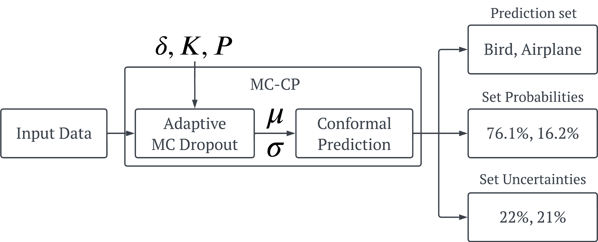
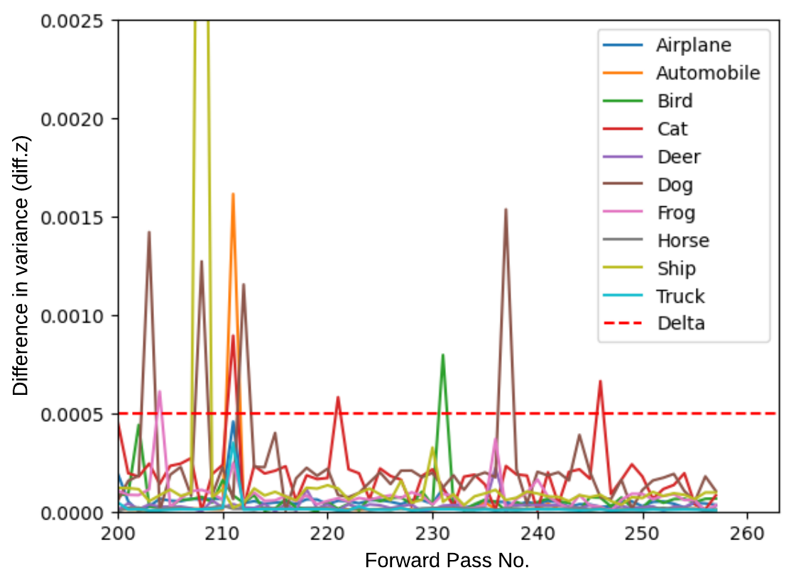

# MC-CP
This repository contains code from my paper on Robust Uncertainty Quantification using Conformalised Monte Carlo Prediction.

### Introduction
Deploying deep learning models in safety-critical applications remains a very challenging task, mandating the provision of assurances for the dependable operation of these models. Uncertainty quantification (UQ) methods estimate the model’s confidence per prediction, informing decision-making by considering the effect of randomness and model misspecification. Despite the advances of state-of-the-art UQ methods, they are computationally expensive or produce conservative prediction sets/intervals. We introduce MC-CP, a novel hybrid UQ method that combines a new adaptive Monte Carlo (MC) dropout method with conformal prediction (CP). MC-CP adaptively modulates the traditional MC dropout at runtime to save memory and computation resources, enabling predictions to be consumed by CP, yielding robust prediction sets/intervals. Throughout comprehensive experiments, we show that MC-CP delivers significant improvements over advanced UQ methods, like MC dropout, RAPS and CQR, both in classification and regression benchmarks. MC-CP can be easily added to existing models, making its deployment simple.

### Adaptive Monte-Carlo Dropout
Our proposed Adaptive MC Dropout method is a novel MC Dropout method that can save computational resources compared to the original method. The motivation underpinning adaptive MC dropout originates from the observation that each forward pass corresponds to a particular DL model instantiation that adds unique variance to the prediction distribution. Some of these DL model instantiations, informed by MC dropout forward passes, can produce similar or even the exact same prediction. Hence, although the prediction variance might be large initially, as the number of forward passes increases, the variance value becomes smaller, indicating that the inference process has converged.

Adaptive MC Dropout requires a few hyperparameters: the model (f), the input/data (x), the maximum number of forward passes (K), the threshold (delta), and the patience (P).

Given a new input (x), the method performs up to (K) forward passes over the model (f) to produce the predictive posterior mean as the final prediction and the variance of the predictive posterior as the prediction uncertainty. Unlike conventional MC dropout, our algorithm uses the hyperparameters threshold (delta) and patience (P) to detect the convergence and terminate early. The threshold parameter (delta) denotes the maximum difference in variance required to trigger that the class/quantile prediction has likely converged. Patience (P) signifies the number of consecutive forward passes where all classes/quantiles are below (delta) to stop the execution early.

In the image below, you can see a visualisation of the Adaptive MC Dropout process on a sample image from the CIFAR-10 dataset. We observe that at approximately 240 forward passes, the variance difference of all classes is below the (delta) threshold, and the patience counter starts increasing with every new iteration. However, at approximately 247 forward passes, the variance difference for class Cat spikes above the threshold; this is due to the stochastic nature of MC dropout. After this, all classes drop below the threshold, and the MC-CP procedure finishes early ten iterations later.

  

### Conformalised Monte-Carlo Prediction
We also propose MC-CP; a hybrid method that addresses major issues common with conformal prediction methods. This method combines conformal prediction algorithms with our Adaptive MC Dropout method.

### Getting Started
All of the code and packages necessary are contained within a Jupyter Notebook in this repository. The majority of datasets used within this paper are pulled* from external websites. The remaining few can be found within this repository, available for download.

### Files
This repository contains the following files:
* `AAAISupplementaryCode.ipynb` - A detailed Jupyter Notebook that will guide readers through our proposed methods.
* `Concrete_Data.csv` - Supplementary data for regression.
* `abalone.data.csv` - Supplementary data for regression.
* `CASP.csv` - Supplementary data for regression.

### Publicly Available Datasets
The datasets used within the experimental results of this paper are:
#### Image Classification
* [CIFAR-10](https://www.cs.toronto.edu/~kriz/cifar.html): CIFAR-10 dataset.
* [CIFAR-100](https://www.cs.toronto.edu/~kriz/cifar.html): CIFAR-100 dataset.
* [MNIST](https://keras.io/api/datasets/mnist/): MNIST digits classification dataset.
* [Fashion-MNIST](https://keras.io/api/datasets/fashion_mnist/): Fashion MNIST dataset.
* [Tiny ImageNet](https://huggingface.co/datasets/zh-plus/tiny-imagenet): Tiny ImageNet dataset.

#### Deep Quantile Regression
* [Boston Housing](https://www.cs.toronto.edu/~delve/data/boston/bostonDetail.html): Boston Housing dataset.
* [Abalone](http://archive.ics.uci.edu/dataset/1/abalone): Abalone dataset.
* [Blog](https://archive.ics.uci.edu/ml/datasets/BlogFeedback): BlogFeedback data set.
* [Concrete](http://archive.ics.uci.edu/ml/datasets/concrete+compressive+strength): Concrete compressive strength dataset.
* [Protein](https://archive.ics.uci.edu/ml/datasets/Physicochemical+Properties+of+Protein+Tertiary+Structure): Physicochemical properties of protein tertiary structure dataset.
